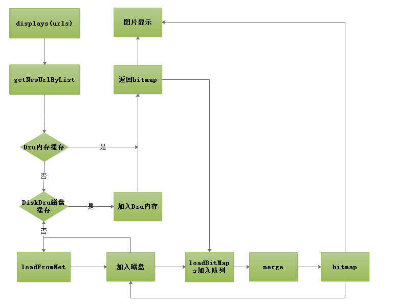
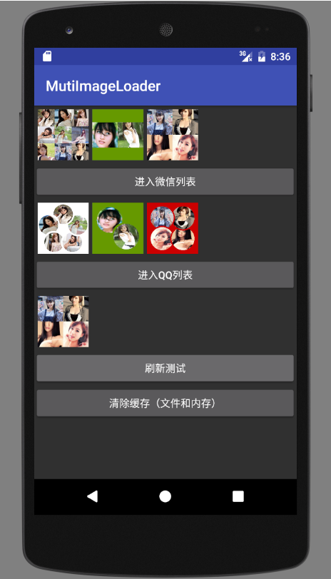

mutiImgLoader是一个实现了DiskLruCache磁盘缓存，Dru内存缓存的图片加载框架。目前内置了微信群头像，QQ群头像的合成加载。并支持自定义扩展其他合成图像方案。

mutiImgLoader使用非常简单。

### 1、单图加载


```
JImageLoader imageLoader = new JImageLoader(Context); //初始化
imageLoader.configDefaultPic(R.drawable.ic_launcher_round);//设置默认加载图

//调用图像加载
public void displayImage(final String url, final ImageView imageView, final int dstWidth, final int dstHeight)

```

### 2、组合图加载


```
public void displayImages(
    final List<String> urls,
    final ImageView imageView, 
    final MergeCallBack mergeCallBack
)

```
### 3、实现自定义的图像合并方案

```
public interface MergeCallBack {
    //图像合并
    Bitmap merge(List<Bitmap> bitmapArray, Context context, ImageView imageView);
    //用于链接标志。切换不同的加载方式，防止缓存碰撞
    String getMark();
}

```

ps:由于merge图像的合成是十分消耗性能的，所以框架自动实现了合并后的图片文件和磁盘缓存和内存缓存。在第二次加载的时候，可以流畅的显示出来。

内部实现原理图

演示图如下

